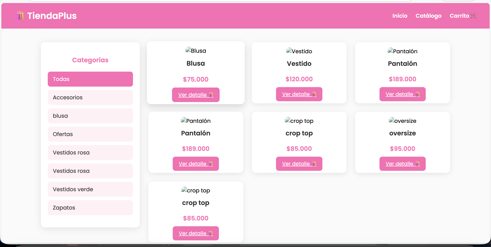
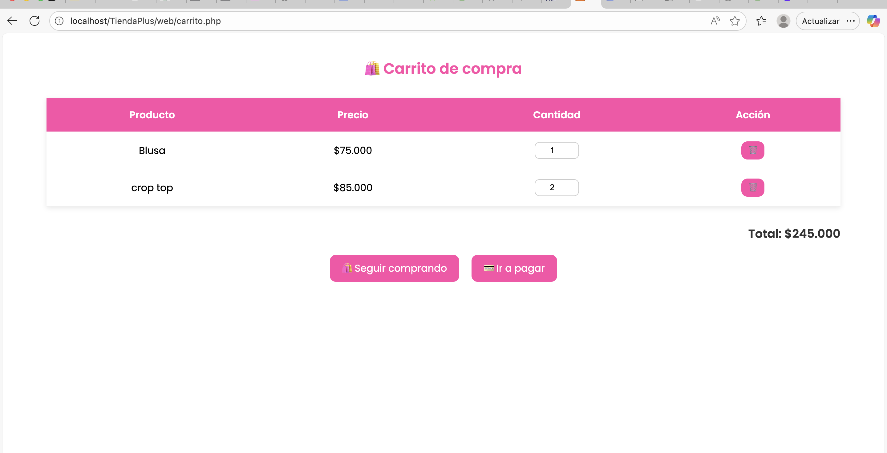
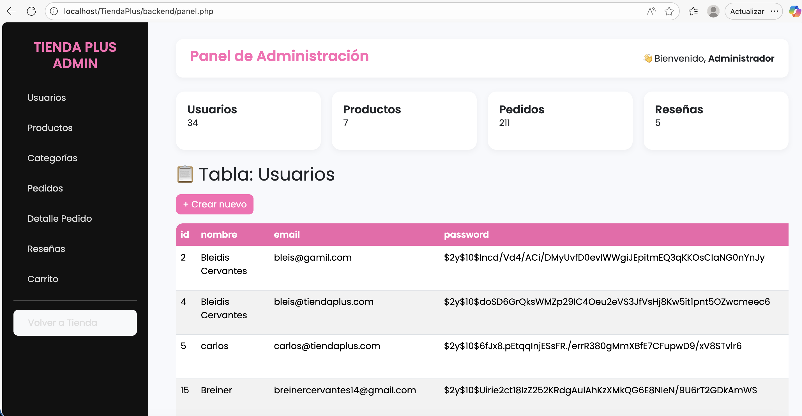

# 🛍️ TiendaPlus

**TiendaPlus** es una tienda web desarrollada como proyecto académico.  
El objetivo es simular una tienda de moda en línea con catálogo, carrito de compras, sistema de usuarios y panel administrativo.

---

## 🚀 Características principales

- 👗 **Catálogo de productos** con imágenes y descripción.  
- 🛒 **Carrito de compras dinámico**.  
- 💳 **Checkout funcional** con registro de pedidos.  
- 👤 **Registro e inicio de sesión** de usuarios.  
- 🛠️ **Panel administrativo** con gestión de:
  - Usuarios
  - Productos
  - Categorías
  - Pedidos
  - Detalle de pedidos
  - Reseñas
  - Carrito

---

## 📂 Estructura del proyecto

TiendaPlus/
│── backend/ # Panel de administración y archivos del sistema
│ │── panel.php # Dashboard admin
│ │── conexion.php
│ │── login.php
│ └── ...
│
includes/ # Conexión a la base de datos
│ └── db.php
│
│── web/ # Frontend de la tienda (usuarios)
│ │── index.php # Página de inicio
│ │── catalogo.php
│ │── producto.php
│ │── carrito.php
│ │── checkout.php
│ │── perfil.php
│ │── login.php
│ │── registro.php
│ │── estilos.css
│ └── img/ # Imágenes de ejemplo
│
─ TiendaPlus.sql # Script de la base de datos
│── README.md # Documentación del proyecto

---

## ⚙️ Instalación en XAMPP

1. Copia la carpeta `TiendaPlus` dentro de:
   - **Windows** → `C:\xampp\htdocs\`
   - **Mac** → `/Applications/XAMPP/htdocs/`

2. Importa la base de datos:
   - Abre **phpMyAdmin** → crea la base **`TiendaPlus`**.
   - Importa el archivo **`TiendaPlus.sql`**.

3. Inicia **Apache** y **MySQL** en XAMPP.

4. Abre en tu navegador:
   - 🏠 [http://localhost/TiendaPlus/web/index.php](http://localhost/TiendaPlus/web/index.php) → Tienda para clientes.  
   - ⚙️ [http://localhost/TiendaPlus/backend/panel.php](http://localhost/TiendaPlus/backend/panel.php) → Panel administrativo.  

---

## 📸 Capturas de pantalla

### 🏠 Página de inicio

### 👗 Catálogo de productos

### 🛒 Carrito de compras

### ⚙️ Panel administrativo

El panel permite gestionar:

- Usuarios  
- Productos  
- Categorías  
- Pedidos  
- Detalle de pedidos  
- Reseñas  
- Carrito

---

## 👩‍💻 Autor

Proyecto desarrollado por **Bleidis Dev**  
📧 Contacto: [GitHub](https://github.com/BleisDev)

---

## 📝 Licencia

Este proyecto es de uso académico y puede ser utilizado como referencia.
